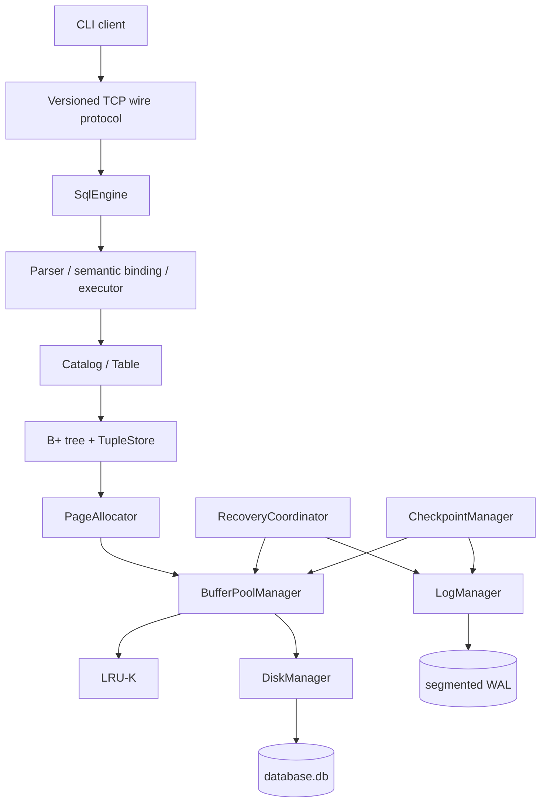

# MiniDB++

MiniDB++ is a relational database engine built from scratch in C++20 to explore
database storage, indexing, query execution, buffering, durability, and crash recovery.
Its design emphasizes explicit binary formats and visible storage-engine boundaries.

## Highlights

- Persistent storage built from fixed 4 KiB pages and variable-length slotted pages
- Durable tuple heaps addressed by stable `(PageId, SlotId)` record identifiers
- Page-native B+ tree primary indexes with split, merge, deletion, and page reclamation
- Persistent schema, catalog, and table layers
- Hand-written SQL lexer, parser, AST, semantic binder, and executor
- Primary-key lookup or deterministic heap-scan access paths
- Bounded buffer pool with move-only RAII page guards and LRU-K eviction
- Persistent free-page reuse through a validated global free list
- Versioned binary TCP protocol with command-line server and client
- CRC32C-protected, segmented write-ahead log with safe segment reclamation
- Implicit atomic recovery units for mutating SQL statements
- STEAL / NO-FORCE physical REDO and UNDO with full-page or byte-range WAL
- Persistent PageLSNs with database-format-v2 selective REDO and v1 migration
- Sharp checkpoints and checkpoint-bounded startup recovery
- Subprocess crash-injection, randomized differential, corruption, and sanitizer tests
- Deterministic benchmark and observability framework

## Architecture



Persistent structures reference pages by `PageId`; transient buffer frames have a
separate `FrameId`. The active relational path uses the bounded buffer pool. The legacy
Pager and fixed-row RecordStore remain for historical and educational regression tests.

## Quick start

Requirements are CMake 3.20 or newer, a C++20 compiler, and a POSIX platform for the
TCP and crash-injection tests.

```bash
cmake -S . -B build -DCMAKE_BUILD_TYPE=Release
cmake --build build --parallel
ctest --test-dir build --output-on-failure
```

Start a database server (default address `127.0.0.1:7432`):

```bash
./build/minidb_server demo.db
```

In another terminal, start the interactive client:

```bash
./build/minidb_client
```

Both programs accept `--host` and `--port`. The client also supports one-shot execution
with `--execute SQL` and access-path counters with `--stats`. Run either executable with
invalid arguments to see its concise usage line.

## Demo

With the server running, these one-shot requests exercise the implemented SQL path:

```bash
./build/minidb_client --execute \
  "CREATE TABLE users (id UINT32 PRIMARY KEY, username VARCHAR(64) NOT NULL, score INT64, active BOOLEAN NOT NULL);"
./build/minidb_client --execute \
  "INSERT INTO users VALUES (1, 'alice', 10, TRUE);"
./build/minidb_client --execute \
  "INSERT INTO users VALUES (2, 'bob', 20, FALSE);"
./build/minidb_client --execute \
  "UPDATE users SET score = 25, active = TRUE WHERE id = 2;"
./build/minidb_client --execute \
  "SELECT id, username, score FROM users WHERE id >= 1 AND active = TRUE;"
./build/minidb_client --execute \
  "DELETE FROM users WHERE id = 1;"
```

The `SELECT` response is rendered as a small text table:

```text
id | username | score
---+----------+------
1  | alice    | 10
2  | bob      | 25
2 rows
```

## SQL scope

| Statement | Current support |
| --- | --- |
| `CREATE TABLE` | Columns, nullability, and one `UINT32 PRIMARY KEY` |
| `INSERT` | One `VALUES` row, with or without an explicit column list |
| `SELECT` | `*` or named projections, optional `WHERE` |
| `UPDATE` | Literal assignments with optional `WHERE` |
| `DELETE` | Optional `WHERE` |

The type system contains `UINT32`, `INT64`, `BOOLEAN`, and `VARCHAR(1..4000)`, plus
`NULL` for nullable columns. `WHERE` supports `=`, `!=`, `<>`, `<`, `<=`, `>`, `>=`,
parentheses, `NOT`, `AND`, and `OR`, with SQL three-valued logic. A suitable primary-key
equality predicate uses the persistent B+ tree; other predicates use a heap scan.

The current grammar intentionally excludes joins, aggregation and `GROUP BY`,
`ORDER BY`, `LIMIT`/`OFFSET`, aliases, subqueries, set operations, secondary indexes,
schema alteration, query optimization, and user-visible `BEGIN`/`COMMIT` transactions.

## Storage engine

Every database file begins with a versioned metadata page, followed by fixed 4096-byte
pages. `PageAllocator` allocates or reuses validated free pages. Variable-length tuple
bytes live in slotted pages; a `RecordId` combines a page ID and stable slot ID, so
in-page compaction can move bytes without invalidating an index entry. `TupleStore`
links those pages into a persistent heap. A page-native B+ tree maps `UINT32` primary
keys to RIDs and maintains its own stable metadata-page identity as roots change.

The exact layouts and invariants are documented in
[storage-format.md](docs/storage-format.md), [slotted-pages.md](docs/slotted-pages.md),
and [bplus-tree-storage.md](docs/bplus-tree-storage.md).

## Buffer pool

The active engine has a fixed number of in-memory frames—128 by default—and uses LRU-K
with `K = 2` by default. A `PageId` identifies persistent storage; a `FrameId` identifies
only a resident cache frame. Fetching pins a frame, and the move-only `ReadPageGuard`
and `WritePageGuard` release that pin through RAII. Write guards carry dirty-page intent.
Only unpinned frames are evictable, and a dirty victim is written after the WAL rule is
satisfied. See [buffer-pool.md](docs/buffer-pool.md).

## WAL and crash recovery

MiniDB++ treats each mutating SQL statement as one implicit recovery unit; it does not
expose user-managed transactions. Physical WAL supports complete 4096-byte page images,
an opt-in byte-range before/after encoding, and opt-in per-record adaptive selection,
with transaction chains, LSNs, and
CRC32C validation. Full-page logging remains the default. The buffer
pool may write an uncommitted dirty page (STEAL) and need not force committed pages at
commit (NO-FORCE), so startup recovery redoes committed winners and undoes the final
uncommitted loser. Persistent PageLSNs let recovery skip committed updates already
represented by an equal or newer disk page; legacy WAL records remain always-redo.

The observable commit rule is:

```text
durable COMMIT    -> recover the statement as committed
no durable COMMIT -> recover the statement as aborted
```

A successful mutation is returned to the client only after its COMMIT record is
fsynced. This is a correctness-first physical logging design and does not claim ARIES,
general transactions, or crash-safe operation without the WAL sidecars.

Recovery is tested by real subprocess termination with `_exit`, bypassing normal
destructors. Directed cases include crashes before and after COMMIT fsync, dirty STEAL
before commit, NO-FORCE winners, repeated crashes during REDO or UNDO, checkpoint
publication boundaries, legacy-WAL migration, segment rotation, and reclamation.
See [wal.md](docs/wal.md), [wal-byte-range.md](docs/wal-byte-range.md),
[wal-adaptive.md](docs/wal-adaptive.md), [page-lsn.md](docs/page-lsn.md), and
[recovery.md](docs/recovery.md).

## Checkpoints and segmented WAL

Sharp, quiescent checkpoints flush the bounded pool and publish a double-slot recovery
pointer. The WAL is split into fixed-capacity segments; after checkpoint publication,
obsolete whole segments behind the retained recovery boundary are safely reclaimed.
See [checkpoints.md](docs/checkpoints.md) and
[wal-segments.md](docs/wal-segments.md).

## Benchmarks

The benchmark runner emits versioned JSON with configuration, latency distributions,
storage/WAL counters, and environment metadata. One deterministic Release measurement
on a single development machine showed the recovery scan boundary effect:

| Recovery mode | Elapsed | WAL scanned |
| --- | ---: | ---: |
| Full historical scan | ~204.97 ms | 33.70 MiB |
| Checkpoint-aware scan | ~2.13 ms | ~331 KiB |

These are reproducible experiment results, not universal performance claims or a
comparison with another database. The suite also includes controlled LRU-K, storage,
SQL, TCP, WAL, transaction, checkpoint, and segment-lifecycle workloads. See
[benchmarking.md](docs/benchmarking.md) and [benchmarks/README.md](benchmarks/README.md).

## Testing

Configure and run the complete suite with warnings enabled:

```bash
cmake -S . -B build -DCMAKE_BUILD_TYPE=Release \
  -DCMAKE_CXX_FLAGS="-Wall -Wextra -Wpedantic"
cmake --build build --parallel
ctest --test-dir build --output-on-failure
```

The suite covers byte-level format validation, deterministic state models, randomized
differential tests, malformed and fuzz-like inputs, real reopen boundaries, TCP
integration, and subprocess crash recovery. The current clean Release verification runs
58 CTest tests. Focused AddressSanitizer and UndefinedBehaviorSanitizer builds are also
used during release verification.

## Documentation

- [Storage architecture](docs/storage-architecture.md)
- [Database storage formats](docs/storage-format.md)
- [Buffer pool and LRU-K](docs/buffer-pool.md)
- [Write-ahead log](docs/wal.md)
- [Physical byte-range WAL experiment](docs/wal-byte-range.md)
- [Adaptive physical WAL update encoding](docs/wal-adaptive.md)
- [Persistent PageLSN and selective REDO](docs/page-lsn.md)
- [Crash recovery](docs/recovery.md)
- [Sharp checkpoints](docs/checkpoints.md)
- [Segmented WAL lifecycle](docs/wal-segments.md)
- [Benchmarking](docs/benchmarking.md)
- [Wire protocol](docs/wire-protocol.md)
- [Server and client](docs/server-client.md)
- [SQL parsing](docs/sql-parser.md) and [execution](docs/sql-execution.md)

## Current limitations

- Database execution is single-threaded, with at most one active mutating statement.
- There is no user-visible transaction syntax, MVCC, locking, or isolation model.
- Byte-range/adaptive WAL adds diff CPU cost; adaptive bounds each update to the smaller
  existing physical encoding, while full-page logging remains the default.
- Sharp checkpoints are synchronous and require a quiescent engine.
- There is no point-in-time recovery or WAL archive.
- Query planning, joins, aggregation, and secondary indexes are not implemented.
- The TCP endpoint has no TLS, authentication, authorization, or multi-client execution;
  it is intended for local development and protocol experimentation.

## Future work

- Finer-grained physiological/logical WAL and recovery experiments
- Fuzzy-checkpoint and dirty-page-table experiments
- Multi-transaction concurrency and isolation
- Additional indexes and query-planning functionality

## Development

The project uses C++20 and CMake. Keep normal builds warning-clean under
`-Wall -Wextra -Wpedantic`, preserve documented persistent and wire formats, and add
focused tests for behavioral or format changes. Generated builds, database files, WAL
sidecars, and benchmark JSON are intentionally ignored.

## License

MiniDB++ is available under the [MIT License](LICENSE).
